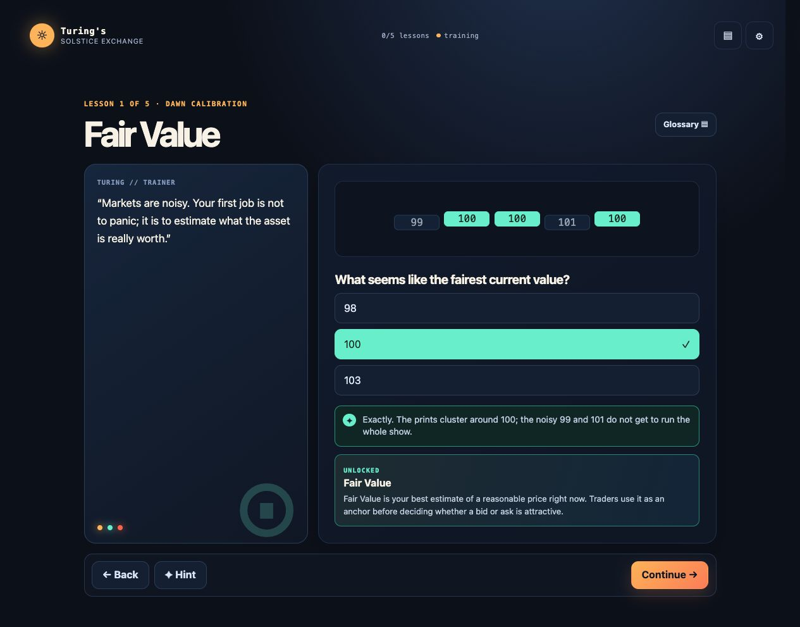
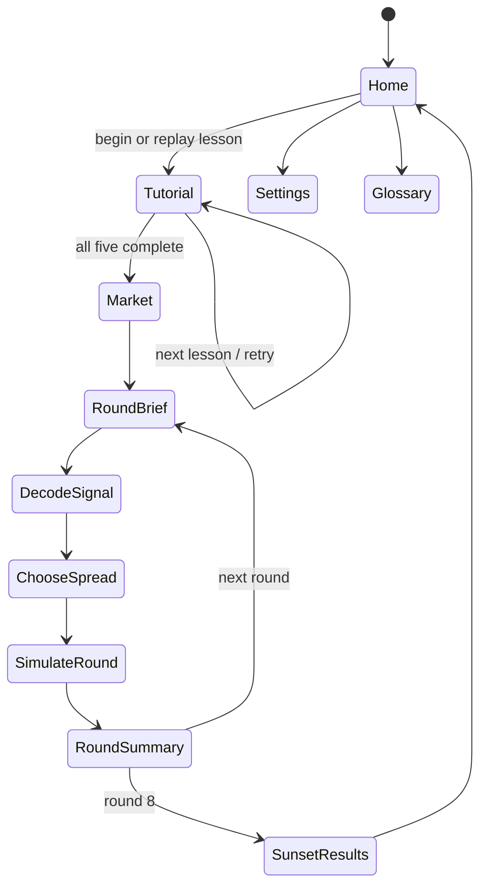
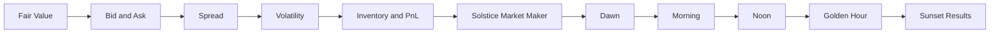
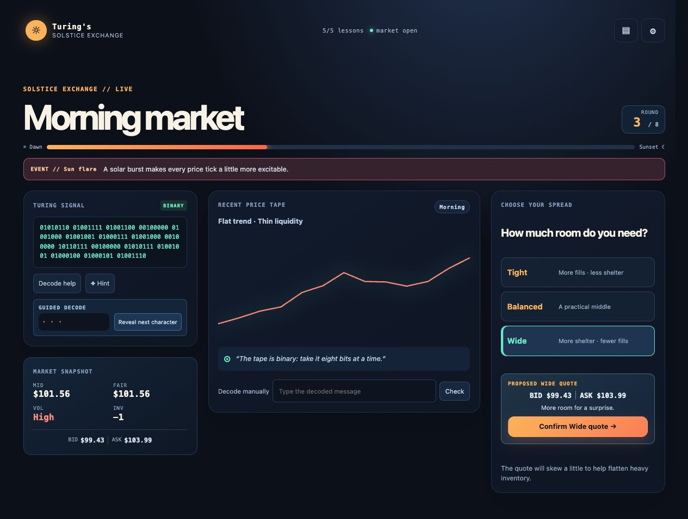
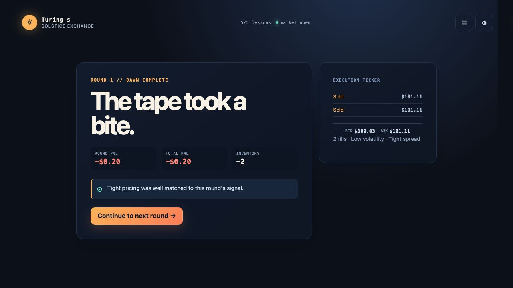

# Turing’s Solstice Exchange

A beginner-friendly browser game for the June Solstice Game Jam. Alan Turing’s fictional training machine teaches five market-making concepts, then opens an eight-round “longest trading day” simulation.



## Run it locally

```bash
npm install
npm run dev
```

Run `npm test`, `npm run lint`, and `npm run build` before release. The project uses a deliberately thin stack: Vite only serves/builds vanilla ES modules; the game itself has no framework runtime or external service dependency.

## Game controls

- Complete the five lessons in order (each can be replayed from home).
- In market mode, read the signal, use Decode help or Hint if needed, then choose Tight, Balanced, or Wide.
- Glossary and settings are available from the top-right controls.
- Progress, settings, capped local event logs, and the current run are saved with `localStorage` on the player’s device.

## Repository structure

| Path | Purpose |
| --- | --- |
| `index.html` | Semantic app shell, skip link, and module entry point |
| `src/main.js` | Renderer, interaction handlers, routing, and accessible game UI |
| `src/styles.css` | Mobile-first retro-solstice visual system and responsive layout |
| `src/config/` | Initial state, design parameters, glossary, and constants |
| `src/state/` | Persistence-backed store and local event logger |
| `src/tutorial/` | Five declarative beginner lessons |
| `src/market/` | Deterministic regimes, special events, ciphers, quote previews, execution, and PnL engine |
| `src/utils/` | Seeded RNG, math helpers, and cipher functions |
| `src/ai/` | Static hint provider and deliberately disabled Gemini-provider contract |
| `src/audio/` | Optional browser-generated UI tones |
| `tests/` | Unit and progression-contract tests |
| `docs/` | DEV post, video script, and release screenshots |
| `.github/workflows/pages.yml` | GitHub Pages build/deploy workflow |

## Phase timeline

| Phase | Status | Delivered |
| --- | --- | --- |
| 0 · Foundation | Complete | Vite shell, persistence, state store, responsive tokens, Pages workflow |
| 1 · Training | Complete | Five replayable, accessible lessons and glossary unlocks |
| 2 · Market maker | Complete | Eight-round deterministic simulation, quotes, signals, PnL, sunset scoring |
| 3 · Polish | Complete | Solstice-terminal UI, optional sound, reduced motion, high contrast, responsive views |
| 4 · Release prep | Complete locally | Tests, screenshots, video script, DEV post, deployment workflow |

## UI components

| Component | Purpose |
| --- | --- |
| Sun/day meter | Makes dawn-to-sunset progress immediate |
| Lesson trail | Shows five short training steps and unlock state |
| Turing trainer card | Gives each lesson a warm machine-teacher voice |
| Signal panel | Displays Binary, Caesar, or logic-clue messages with help/hints |
| Market snapshot | Keeps mid, fair value, volatility, inventory, and quote visible |
| Sparkline | Shows price behavior without making the game chart-heavy |
| Quote preview | Shows actual bid/ask and the risk trade-off before a spread is committed |
| Guided decoder | Reveals one signal character at a time without taking the puzzle away |
| Market-event strip | Adds Sun Flare, Thin Books, and Reversal Watch conditions |
| Execution ticker | Shows fills and quote used after a round |
| Round summary | Relates outcome back to one teachable decision |
| Sunset results | Final PnL, PnL-by-round chart, best decision, peak inventory risk, and coach note |
| Glossary | Unlockable plain-English definitions |
| Settings | Sound, motion, contrast, captions, and font scale preferences |

## Game flow





## Implementation notes

- The simulation is deterministic for a seed. Regimes, signals, special events, price shocks, fills, PnL, and score are reproducible in tests and demos.
- Quote generation applies a volatility-adjusted half-spread and an inventory skew. Positive inventory shifts quotes down slightly to encourage selling it down; negative inventory does the inverse.
- Ciphers are intentionally kind: Binary is grouped eight-bit character codes, Caesar uses a fixed shift of 3, and logic clues are readable conditional rules.
- Accessibility is designed into the DOM-first UI: semantic headings, real buttons/inputs, visible focus, 44px interactive controls, ARIA live status feedback, reduced-motion handling, high-contrast mode, and scalable text.
- There are no third-party analytics, no client-side API keys, and no network dependency once assets are loaded. `GeminiHintProvider` is a disabled interface only; `StaticHintProvider` is the shipping hint system.

## Tests

The unit suite covers deterministic RNG-backed simulation behavior, quote direction, PnL marking, Binary encoding, Caesar encode/decode, initial state, and persistence. The integration contract checks that all required terms unlock and market access opens after the fifth lesson.

Manual browser QA completed locally:

- full tutorial completion and glossary unlock path;
- Caesar signal decoding, guided character reveal, spread-preview/confirmation, special-event display, and simulated market rounds;
- desktop screenshot capture;
- keyboard-visible focus and screen-reader-visible semantic controls inspected through the rendered DOM.

## Deployment status

The repository contains a GitHub Pages Actions workflow targeting `main`. To publish, push this repository to GitHub, set **Settings → Pages → Source** to **GitHub Actions**, and push to `main`. The workflow builds `dist/` and deploys it using the official Pages action sequence. A public demo URL cannot be created until the repository has a GitHub remote and is pushed.

## Social preview and screenshots

The release includes a generated Open Graph image and matching title/description metadata in `index.html`.







## AI disclosure

This game was implemented with AI-assisted development tooling. The public game itself does **not** make generative-AI requests and does not expose an API key. It ships with authored static hints. The `GeminiHintProvider` module is a disabled extension point for a future server-backed integration only; it is not enabled in this build.

The social-preview background was generated with OpenAI image generation, then added as a static project asset. No generated image is used during gameplay.

See [the video script](./docs/video-script.md) and [the DEV submission draft](./docs/devto-submission.md) for release copy.
